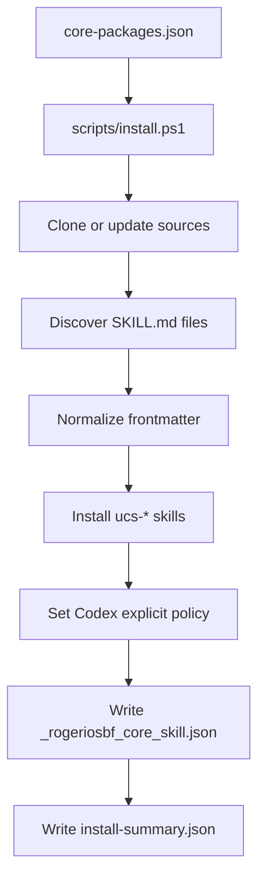

# Architecture

rogeriosbf CORE Skills is intentionally small and focused.

## What It Contains

- A **package manifest** (`manifests/core-packages.json`) with upstream repositories and installation policy.
- One **installer** (`scripts/install.ps1`) that clones sources into a local cache.
- **Platform adapters** that copy normalized `SKILL.md` folders into local agent skill roots.
- An **uninstaller** (`scripts/uninstall.ps1`) that cleanly removes only managed skills.
- **Reports** that show what was installed.

## What It Does NOT Do

- Vendor upstream skill packs into this repository.
- Enable all skills implicitly (Codex skills are explicit-only).
- Run third-party hooks or install scripts by default.
- Overwrite or remove unmanaged user skills.

## Installation Flow



## Managed Marker

Every copied skill gets a marker file:

```text
_rogeriosbf_core_skill.json
```

This file records: package origin, source repo, install timestamp, and platform. On reinstall or uninstall, only directories with this marker are removed. Existing user skills are never touched.

## Naming Convention

Imported skills use:

```text
ucs-<package>-<skill>-<hash>
```

The `ucs-` prefix (Unified CORE Skills) ensures:
- Easy identification of managed vs. custom skills.
- No naming collisions with upstream skill names.
- Names are kept short enough for strict skill validators (≤64 chars).

## Platform Targets

| Platform | Primary Path | Mirror Path |
|----------|-------------|-------------|
| Codex | `~/.agents/skills` | `~/.codex/skills` |
| Claude | `~/.claude/skills` | — |
| Antigravity | `~/.gemini/antigravity/skills` | — |

## Local Cache

All cloned sources and reports live under:

```text
~/.rogeriosbf-core-skills/
├── sources/       # Shallow clones of upstream repos
└── reports/       # install-summary.json
```
