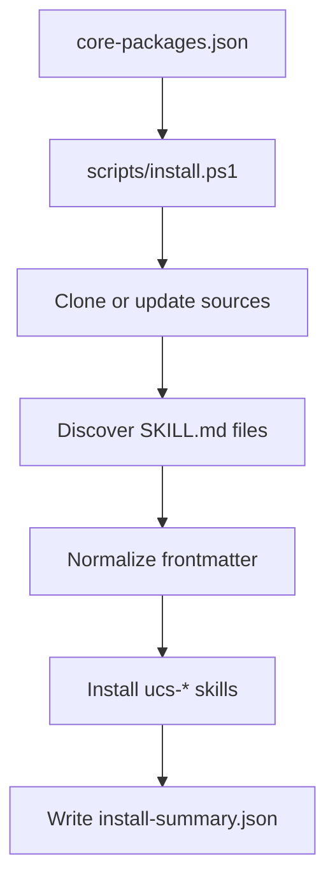

# Architecture

Unlimited CORE Skills is intentionally small.

It contains:

- A package manifest with upstream repositories and installation policy.
- One installer that clones sources into a local cache.
- Platform adapters that copy normalized `SKILL.md` folders into local agent skill roots.
- Reports that show what was installed.

It does not:

- Vendor the upstream skill packs.
- Enable all skills implicitly.
- Run third-party hooks by default.
- Overwrite unmanaged user skills.

## Flow



## Managed Marker

Every copied skill gets:

```text
_unlimited_core_skill.json
```

On reinstall, only directories with this marker are removed. Existing user skills are left alone.

## Naming

Imported skills use:

```text
ucs-<package>-<skill>-<hash>
```

Names are kept short enough for strict skill validators.
