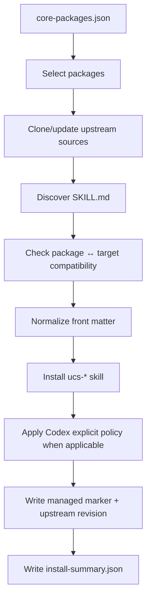

# Architecture

rogeriosbf CORE Skills is a deliberately small bootstrap/interoperability layer around third-party agent skill repositories.

## Components

- **Manifest** — `manifests/core-packages.json` stores upstream repositories, compatible hosts, discovery roots, and install/reference policy.
- **Installer** — `scripts/install.ps1` clones sources, discovers skills, normalizes metadata, applies host policy, and writes managed markers.
- **Platform adapters** — map a normalized skill into Codex, Claude, or Antigravity locations.
- **Uninstaller** — `scripts/uninstall.ps1` removes only marked managed directories.
- **Validator** — `scripts/validate.ps1` checks repository and manifest invariants.
- **Upstream health checker** — `scripts/check-upstreams.ps1` verifies that manifest repositories remain reachable.
- **Reports** — installations emit a machine-readable summary.

## Non-goals

The project does not:

- vendor upstream skill packs;
- relicense third-party content;
- execute upstream setup logic by default;
- implicitly enable a large Codex skill library;
- delete unmanaged user skills.

## Installation flow


```mermaid
flowchart TD
  A["core-packages.json"] --> B["Select packages"]
  B --> C["Clone/update upstream sources"]
  C --> D["Discover SKILL.md"]
  D --> E["Check package ↔ target compatibility"]
  E --> F["Normalize front matter"]
  F --> G["Install ucs-* skill"]
  G --> H["Apply Codex explicit policy when applicable"]
  H --> I["Write managed marker + upstream revision"]
  I --> J["Write install-summary.json"]
```

## Platform compatibility

Each package declares a `platforms` array. Installer target names are normalized for compatibility checks:

- `codex-legacy` → `codex`
- `claude` → `claude-code`
- `antigravity` → `antigravity`

This prevents host-specific packages from being copied into incompatible targets.

## Managed marker

Every installed skill receives:

```text
_rogeriosbf_core_skill.json
```

It records:

- package ID and name;
- upstream repository;
- upstream revision when available;
- source skill path;
- installed skill name;
- target platform;
- install timestamp.

The marker is the safety boundary for reinstall/uninstall behavior.

## Naming

```text
ucs-<package>-<skill>-<hash>
```

The deterministic prefix and short hash reduce naming collisions and make managed skills easy to identify.

## Platform targets

| Host | Primary path | Compatibility mirror |
|---|---|---|
| Codex | `~/.agents/skills` | `~/.codex/skills` |
| Claude Code/Cowork | `~/.claude/skills` | — |
| Antigravity | `~/.gemini/antigravity/skills` | — |

## Local workspace

```text
~/.rogeriosbf-core-skills/
├── sources/
└── reports/
    └── install-summary.json
```

## Validation model

CI runs the same `scripts/validate.ps1` entry point available to contributors. It checks:

- manifest schema version;
- required package fields;
- package ID uniqueness/format;
- HTTPS GitHub clone URLs;
- recognized platform identifiers;
- contradictory install/reference flags;
- installable packages with missing skill roots;
- PowerShell parser validity for core scripts;
- presence of at least one installable Codex package.

A separate scheduled job checks upstream reachability.
